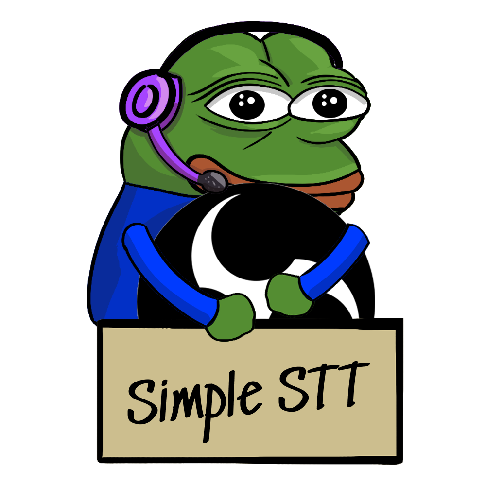
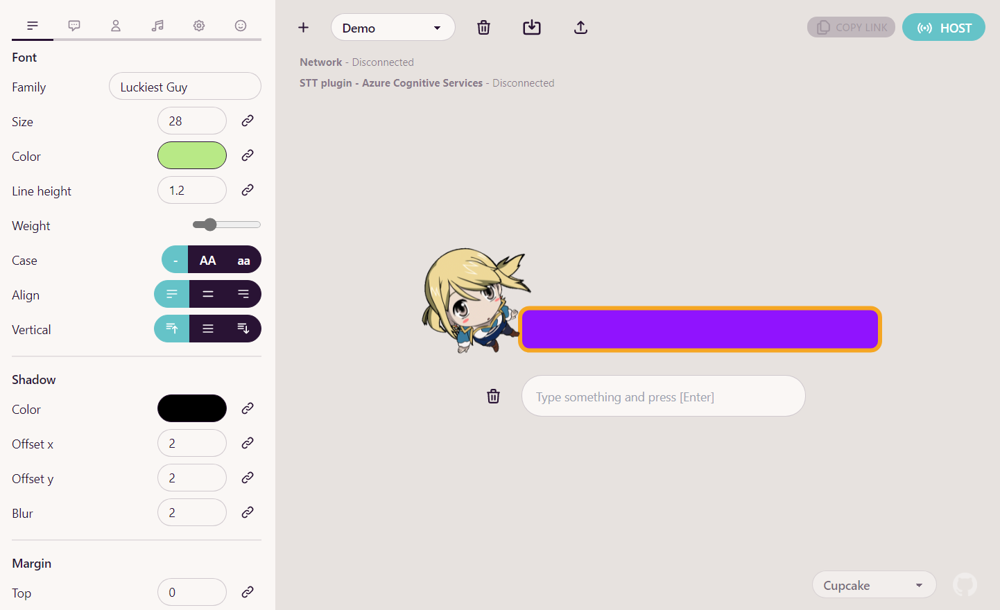
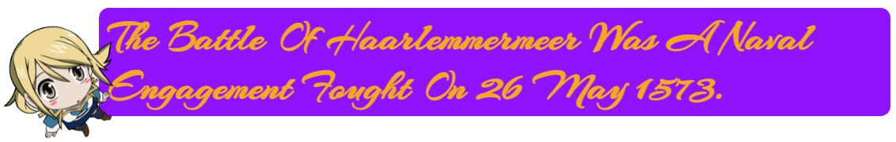

<h1 align="center"></h1>
<p align="center">
  Speech-to-text and keyboard input captions for OBS.<br>
  <a href="#examples">See examples</a><br>
</p>

## Features
-  **Web version**
-  **Standalone version**
-  **Keyboard only mode**
-  **Deep visual customization**
-  **Twitch/BTTV/FFZ emotes integration**
-  **Google Fonts integration** - about 1000 free fonts
-  **Simple OBS integration**
-  **Auto saves styles and configuration**
-  **Style changes applied on the fly**
-  **Share captions with multiple browser sources over the network**

## Main view


## STT Plugins
-  [Azure Speech Services](https://azure.microsoft.com/en-us/pricing/details/cognitive-services/speech-services/) - high quality speech recognition, has free tier with 5 hours of audio per month, setup is kinda complicated
-  [Browser native](https://caniuse.com/speech-recognition) - browser integrated api. Not available in desktop version
-  Noop - keyboard input only

## Quick start
1. Open [host page](https://mmpneo.github.io/simple-obs-stt)
2. Press "Host" button on the top-right
3. Start captions server
4. Select STT plugin and start it, if required
5. Copy client link on the left of "Host" button
6. Create browser source in OBS and past link

## Examples





## Planned
- [x] Twitch emotes integration
- [x] Fonts - Google fonts integration
- [x] Style Templates - Instant switching between styles. For ex: Swappable styles for different games
- [ ] Sounds - typing sounds
- [ ] Text animation - simple appearing animation
- [ ] Custom background for host preview

## Standalone version
Experimental, WebView2(Edge) based, electron-like app.  
Works offline (Still requires connection for STT).

**How to build**  
*Tested on windows.*  
*Node 14 and Rust stable required.*
1. Clone repo
2. ``` npm i ```
3. ``` npx ng build --configuration=tauri ```
4. ```npx tauri build```
5. Build will be available at *./src-tauri/target/release/*


 DO DO DO  DO DO DO  DO DO DO  DO DO DO  DO DO DO 
