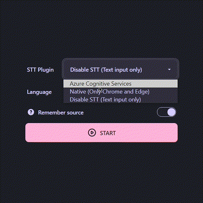
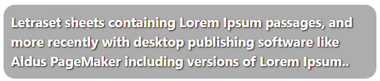
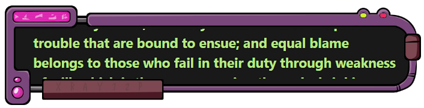
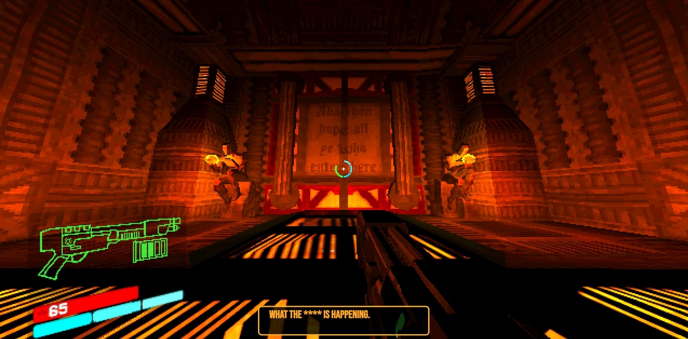

# Simple STT 
Real-time speech-to-text and keyboard input captions for OBS.  
[See examples](#examples)

## Why
This project was started because I personally needed a free, simple and performant solution to compensate speech impairments and overall shyness with captions.  
The current goal of this project is to help streamers with similar problems to make their streams more interactive and engaging.

## Features
-  **No installation required**
-  **Deep visual customization**
-  **Google Fonts integration (1000 fonts)**
-  **Simple OBS integration**
-  **Auto saves styles and configuration**
-  **Style changes applied on the fly**
-  **Use the same captions source on multiple clients simultaneously**

## STT Plugins
-  [Azure Speech Services](https://azure.microsoft.com/en-us/pricing/details/cognitive-services/speech-services/) - high quality speech recognition, has free tier with 5 hours of audio per month, setup is kinda complicated
-  [Browser native](https://caniuse.com/speech-recognition) - utilizes browser integrated api. (MS Edge quality is similar to Azure, but free, btw)
-  Noop - disable speech recognition and use text input only

## How to start
1. Open [host page](https://mmpneo.github.io/simple_obs_stt)
2. Select stt plugin
2. Select language to recognize
3. Start
4. Copy client link
5. Create browser source and past link




## Examples






## Planned
- [x] Fonts - Google fonts integration
- [ ] Style Templates - Instant switching between styles. For ex: Swappable styles for different games
- [ ] Text animation - different text typing animations
- [ ] Twitch emotes integration
- [ ] Sounds - typing sounds, text bubble appearing sound etc
- [ ] Custom background for host preview

## Standalone version
Experimental, WebView2(Edge) based, electron-like app.  
Works offline (Still requires connection for STT).

**How to build**  
*Tested on windows.*  
*Node 14 and Rust stable required.*
1. Clone repo
2. ``` npm run build ```
3. ```npx tauri build```
4. Build will be available at *./src-tauri/target/release/*


 DO DO DO  DO DO DO  DO DO DO  DO DO DO  DO DO DO 
